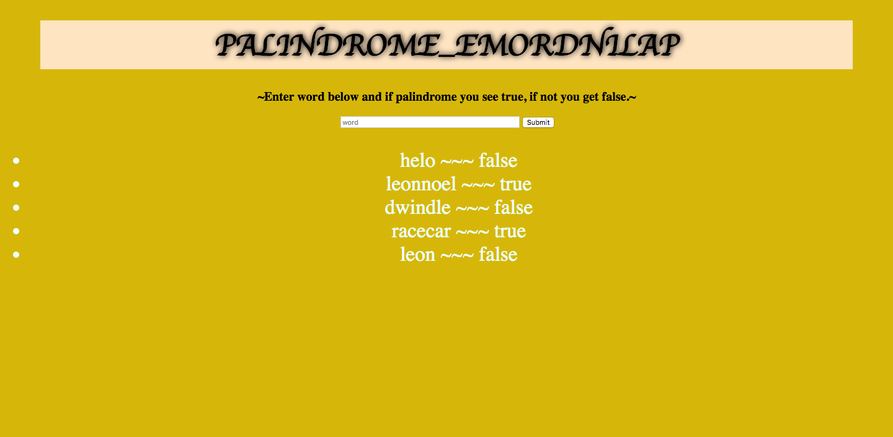

# This is an application that enables the user to enter any word and have it respond with whether is it the same spelled backwards and if that is the cause it confirms with "true" or "false".

## Programs Used
JavaScript, Node JS, CSS, HTML, MongoDB

## Installation

1. Clone repo
2. run `npm install`

## Usage

1. run `npm run savage`
2. Navigate to `localhost:3000`

